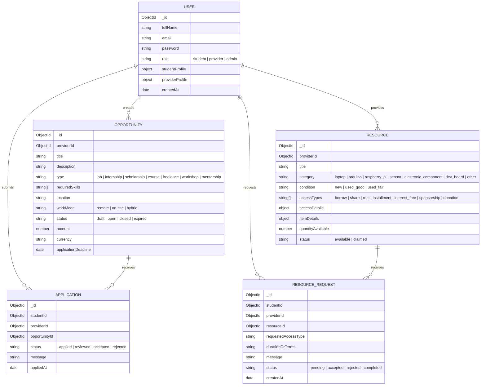

# 🌉 TechBridge

> **Digital Opportunity Bridge for Technology Students**  
> Empowering students across Information & Communication Technology (ICT), Engineering Technology (ET), Biosystems Technology (BST), and Multidisciplinary Studies (MDS) by connecting them directly with industry opportunities, hardware resources, mentors, and academic networks.

[](https://www.typescriptlang.org/)
[](https://react.dev/)
[](https://vitejs.dev/)
[](https://tailwindcss.com/)
[](https://expressjs.com/)
[](https://www.mongodb.com/)
[](https://nodejs.org/)

---

## 📖 Table of Contents

- [Overview](#-overview)
- [Core Value Propositions](#-core-value-propositions)
- [Key Features](#-key-features)
  - [1. Role-Based Portals & Authentication](#1-role-based-portals--authentication)
  - [2. Intelligent Opportunity Match Engine](#2-intelligent-opportunity-match-engine)
  - [3. Hardware & Technical Resource Hub](#3-hardware--technical-resource-hub)
  - [4. Applications & Opportunity Lifecycle](#4-applications--opportunity-lifecycle)
  - [5. Faculty & Alumni Community Directory](#5-faculty--alumni-community-directory)
  - [6. Impact & Analytics Dashboard](#6-impact--analytics-dashboard)
- [Tech Stack](#-tech-stack)
- [Project Architecture & Directory Structure](#-project-architecture--directory-structure)
- [Database Schema Models](#-database-schema-models)
- [REST API Endpoints](#-rest-api-endpoints)
- [Getting Started](#-getting-started)
  - [Prerequisites](#prerequisites)
  - [Backend Setup](#backend-setup)
  - [Database Seeding](#database-seeding)
  - [Frontend Setup](#frontend-setup)
  - [Running the Full Stack](#running-the-full-stack)
- [Environment Variables](#-environment-variables)
- [Default Credentials](#-default-credentials)
- [Contributing & License](#-license)

---

## 🌟 Overview

Students in technology disciplines frequently face hurdles when discovering career opportunities, obtaining technical hardware (such as laptops, microcontrollers, and sensors), and connecting with faculty and industry mentors. Information is often scattered across social media, messaging apps, and fragmented bulletin boards.

**TechBridge** centralizes this ecosystem into a single unified platform built specifically with the needs of technology faculties (such as the Faculty of Technology, University of Ruhuna) in mind. It enables organizations, alumni, faculty, and industry partners to post opportunities and share equipment while giving students transparent access to apply, borrow, and grow.

---

## 🎯 Core Value Propositions

TechBridge organizes student growth around four key pillars:

| Pillar | Focus | What TechBridge Delivers |
| :--- | :--- | :--- |
| **💼 EARN** | Employment & Freelance | Full-time/part-time jobs, freelance gigs, and remote software/hardware contracts. |
| **🎓 LEARN** | Skill Development | Technical courses, workshops, hands-on training, and expert 1-on-1 mentorship. |
| **🚀 EXPERIENCE** | Industry Exposure | Industrial internships, research lab projects, and field engineering placements. |
| **💻 ACCESS** | Hardware & Tools | Laptops, Arduino boards, Raspberry Pi units, sensors, and dev kits via borrowing, rentals, installment schemes, 0% interest financing, sponsorships, and donations. |

---

## ✨ Key Features

### 1. Role-Based Portals & Authentication
- **Students**: Complete profiles capturing degree program (`ICT`, `ET`, `BST`, `other`), study year (1–6), technical skills, career goals, work mode preference (`remote`, `on-site`, `hybrid`, `flexible`), availability hours, certifications, and portfolio URLs.
- **Providers**: Specialized onboarding for Companies, Training Organizations, Scholarship Organizations, Resource Providers, Local Businesses, Alumni, Faculty, NGOs, and Individuals. Includes verification status (`PENDING` / `VERIFIED`) and capability controls.
- **Admins**: Verification management and platform-wide moderation.
- **Security**: JWT Bearer token authentication with automated 401 handling, password hashing via `bcryptjs` (salt factor 12), and request validation via `express-validator`.

### 2. Intelligent Opportunity Match Engine
- **Rule-Based Scoring**: Custom multi-factor matching algorithm calculating a 0–100% compatibility score:
  - **60% Skills Compatibility**: Fuzzy string matching (normalizes hyphens, dots, case) against student skills and listing requirements.
  - **25% Career Relevance**: Semantic mapping between career targets (e.g., developer, engineer, researcher) and listing categories.
  - **15% Location Fit**: Matches preferred regions and work modes.
- **Skill Gap Bridge**: Automatically identifies missing skills and recommends tailored learning resources to help the student qualify.

### 3. Hardware & Technical Resource Hub
- **Detailed Hardware Catalog**: Item-specific specifications for Laptops (CPU, RAM, storage, GPU, display), Arduino microcontrollers, Raspberry Pi SBCs, sensors, and development boards.
- **Flexible Access Models**:
  - **Borrow / Share**: Short-term loans with pickup locations and return terms.
  - **Rent**: Monthly rental terms with optional security deposit.
  - **Installments**: Split purchase pricing across multiple months.
  - **0% Interest**: Ethical installment plans with no interest rate.
  - **Sponsorship & Donation**: Free equipment grants for eligible students.
- **Request Lifecycle**: Students submit detailed request proposals; providers review, accept, reject, or mark requests as fulfilled.

### 4. Applications & Opportunity Lifecycle
- Student one-click applications with custom statements and profile snapshots.
- Single-application constraint per opportunity to avoid spam.
- Provider portal with status pipelines (`applied` ➔ `reviewed` ➔ `accepted` / `rejected`).
- Auto-expiration of opportunities past their deadline.

### 5. Faculty & Alumni Community Directory
- Direct access to verified Faculty of Technology academic staff (ICT, Engineering Technology, Biosystems Technology, Multidisciplinary Studies departments).
- Official University of Ruhuna Alumni Association committee contacts and industry workplaces.
- Instant search and filtering by department, expertise, and company.

### 6. Impact & Analytics Dashboard
- Live platform statistics displaying registered students, open opportunities, applications submitted, and hardware resources accessed.
- Distribution breakdowns of application statuses and resource access methods.
- Provider-specific views and metrics on listing performance.

---

## 🛠 Tech Stack

### Frontend
- **Framework**: [React 19](https://react.dev/) + [TypeScript](https://www.typescriptlang.org/)
- **Build Tool**: [Vite 8](https://vitejs.dev/) with Fast Refresh & HTTP proxy
- **Routing**: [React Router DOM v7](https://reactrouter.com/)
- **Styling**: [Tailwind CSS v4](https://tailwindcss.com/) (using `@tailwindcss/vite`)
- **Icons**: [Lucide React](https://lucide.dev/)
- **HTTP Client**: [Axios](https://axios-http.com/) with JWT interceptors

### Backend
- **Runtime**: [Node.js](https://nodejs.org/) (ESNext / CommonJS with TypeScript)
- **Framework**: [Express 5](https://expressjs.com/)
- **Language**: [TypeScript](https://www.typescriptlang.org/) executed via [tsx](https://github.com/privatenumber/tsx)
- **Database**: [MongoDB](https://www.mongodb.com/) via [Mongoose 8](https://mongoosejs.com/)
- **Authentication**: [JSON Web Tokens (jsonwebtoken)](https://jwt.io/) & [bcryptjs](https://github.com/dcodeIO/bcrypt.js)
- **Validation**: [express-validator](https://express-validator.github.io/)
- **CORS & Security**: `cors`, `dotenv`

---

## 📂 Project Architecture & Directory Structure

```text
Tech_Bridge/
├── backend/                       # Express + TypeScript REST API Server
│   ├── .env                       # Backend environment variables
│   ├── package.json               # Backend dependencies & scripts
│   ├── tsconfig.json              # Backend TypeScript configuration
│   └── src/
│       ├── config/
│       │   └── db.ts              # MongoDB Mongoose connection setup
│       ├── controllers/           # HTTP controllers for all domain entities
│       │   ├── applicationController.ts
│       │   ├── authController.ts
│       │   ├── dashboardController.ts
│       │   ├── matchController.ts
│       │   ├── opportunityController.ts
│       │   ├── providerController.ts
│       │   ├── resourceController.ts
│       │   └── resourceRequestController.ts
│       ├── middleware/            # Express request interceptors
│       │   ├── auth.ts            # JWT verification & RBAC authorization
│       │   └── validate.ts        # express-validator result handler
│       ├── models/                # Mongoose database schemas
│       │   ├── Application.ts     # Opportunity application submissions
│       │   ├── Opportunity.ts     # Jobs, internships, scholarships, courses
│       │   ├── Resource.ts        # Hardware specifications & access models
│       │   ├── ResourceRequest.ts # Hardware borrow/rent/claim requests
│       │   └── User.ts            # Student, Provider, and Admin profiles
│       ├── routes/                # API route definitions
│       │   ├── applicationRoutes.ts
│       │   ├── authRoutes.ts
│       │   ├── dashboardRoutes.ts
│       │   ├── opportunityRoutes.ts
│       │   ├── providerRoutes.ts
│       │   ├── publicProviderRoutes.ts
│       │   ├── resourceRequestRoutes.ts
│       │   └── resourceRoutes.ts
│       ├── utils/                 # Business logic helpers & calculations
│       │   ├── jwt.ts             # JWT token sign & verify
│       │   ├── matchEngine.ts     # Opportunity matching & scoring engine
│       │   └── providerCapabilities.ts # Capability matrix per organization type
│       ├── seed.ts                # Database seeder (creates default admin)
│       └── server.ts              # Express application bootstrap
│
├── frontend/                      # React 19 + Vite Single Page Application
│   ├── index.html                 # Main HTML entry point
│   ├── package.json               # Frontend dependencies & scripts
│   ├── vite.config.ts             # Vite configuration & backend proxy
│   ├── tsconfig.json              # TypeScript root config
│   ├── public/                    # Static assets & public illustrations
│   └── src/
│       ├── App.tsx                # Client-side route declarations
│       ├── main.tsx               # React DOM root render
│       ├── index.css              # Tailwind CSS configuration & tokens
│       ├── api/                   # Typed Axios API clients
│       │   ├── axios.ts           # Axios instance with auth interceptors
│       │   ├── applicationApi.ts
│       │   ├── authApi.ts
│       │   ├── dashboardApi.ts
│       │   ├── opportunityApi.ts
│       │   ├── providerApi.ts
│       │   ├── resourceApi.ts
│       │   └── resourceRequestApi.ts
│       ├── components/            # Reusable UI components
│       │   ├── AppHeader.tsx      # Main application navigation header
│       │   ├── PortalLayout.tsx   # Dashboard container layout
│       │   ├── ProtectedRoute.tsx # Route guard for authentication & roles
│       │   └── landing/           # Landing page sections & showcases
│       ├── context/
│       │   └── AuthContext.tsx    # Global user session & state
│       ├── data/
│       │   └── facultyConnections.ts # University of Ruhuna staff & alumni data
│       ├── pages/                 # Full-page views (20+ interactive screens)
│       │   ├── LandingPage.tsx
│       │   ├── LoginPage.tsx
│       │   ├── RegisterPage.tsx
│       │   ├── DashboardPage.tsx
│       │   ├── OpportunityFeedPage.tsx
│       │   ├── OpportunityDetailPage.tsx
│       │   ├── ResourceHubPage.tsx
│       │   ├── ResourceListingPage.tsx
│       │   ├── ResourceRequestPage.tsx
│       │   ├── FacultyConnectionsPage.tsx
│       │   ├── ImpactDashboardPage.tsx
│       │   ├── StudentProfilePage.tsx
│       │   ├── MyApplicationsPage.tsx
│       │   ├── MyResourceRequestsPage.tsx
│       │   ├── MyActivityPage.tsx
│       │   ├── ProviderDashboardPage.tsx
│       │   ├── ProviderPortalPage.tsx
│       │   ├── ProviderResourcesPage.tsx
│       │   ├── ProviderApplicationsPage.tsx
│       │   ├── ProviderResourceRequestsPage.tsx
│       │   ├── ProviderProfilePage.tsx
│       │   └── PublicProviderProfilePage.tsx
│       └── types/
│           └── index.ts           # Central TypeScript types & interfaces
│
└── README.md                      # Project documentation
```

---

## 🗄 Database Schema Models



---

## 🔌 REST API Endpoints

### 🔑 Authentication (`/api/auth`)
| Method | Endpoint | Access | Description |
| :--- | :--- | :--- | :--- |
| `POST` | `/api/auth/register` | Public | Register a new Student or Provider account |
| `POST` | `/api/auth/login` | Public | Authenticate user and obtain JWT token |
| `GET` | `/api/auth/me` | Private | Get currently authenticated user profile |
| `PUT` | `/api/auth/student-profile` | Student | Update student education, skills, and preferences |

### 💼 Opportunities (`/api/opportunities`)
| Method | Endpoint | Access | Description |
| :--- | :--- | :--- | :--- |
| `GET` | `/api/opportunities` | Public | List, filter, search, and paginate opportunities |
| `GET` | `/api/opportunities/scholarships`| Public | Filtered list of open scholarships |
| `GET` | `/api/opportunities/matched` | Student | Get opportunities scored & ranked by the Match Engine |
| `GET` | `/api/opportunities/mine` | Provider | List opportunities created by logged-in provider |
| `GET` | `/api/opportunities/:id` | Public | Get single opportunity details & view count |
| `POST` | `/api/opportunities` | Provider (Verified) | Publish a new opportunity |
| `PUT` | `/api/opportunities/:id` | Provider (Verified) | Edit existing opportunity |
| `DELETE`| `/api/opportunities/:id` | Provider (Verified) | Remove opportunity |

### 💻 Technical Resources (`/api/resources`)
| Method | Endpoint | Access | Description |
| :--- | :--- | :--- | :--- |
| `GET` | `/api/resources` | Public | Explore available hardware inventory and access terms |
| `GET` | `/api/resources/mine` | Private | List resources managed by current provider |
| `GET` | `/api/resources/:id` | Public | Retrieve detailed specifications and terms for an item |
| `POST` | `/api/resources` | Private | Add hardware equipment or technical resources |
| `PATCH`| `/api/resources/:id/status` | Private | Toggle resource availability (`available` / `claimed`) |
| `PATCH`| `/api/resources/:id/inventory`| Private | Adjust inventory quantities |
| `DELETE`| `/api/resources/:id` | Private | Delete resource listing |

### 📝 Applications (`/api/applications`)
| Method | Endpoint | Access | Description |
| :--- | :--- | :--- | :--- |
| `POST` | `/api/applications` | Student | Submit an application for an open opportunity |
| `GET` | `/api/applications/mine` | Student | List applications submitted by current student |
| `GET` | `/api/applications/provider`| Provider | View all student applications received across listings |
| `GET` | `/api/applications/opportunity/:id`| Provider | View applications for a specific listing |
| `PATCH`| `/api/applications/:id/status`| Provider | Update application state (`reviewed`, `accepted`, `rejected`) |

### 📦 Resource Requests (`/api/resource-requests`)
| Method | Endpoint | Access | Description |
| :--- | :--- | :--- | :--- |
| `POST` | `/api/resource-requests` | Student | Submit request to borrow/rent/claim hardware |
| `GET` | `/api/resource-requests/mine` | Student | List all hardware requests made by student |
| `GET` | `/api/resource-requests/provider`| Provider | List hardware requests for provider's items |
| `PATCH`| `/api/resource-requests/:id/status` | Private | Update request state (`accepted`, `rejected`, `completed`) |

### 📊 Dashboard & Public Providers (`/api/dashboard`, `/api/providers`, `/api/provider`)
| Method | Endpoint | Access | Description |
| :--- | :--- | :--- | :--- |
| `GET` | `/api/dashboard/stats` | Private | Aggregate platform impact metrics |
| `GET` | `/api/provider/dashboard` | Provider | Provider metrics (total listings, views, applicant counts) |
| `PUT` | `/api/provider/profile` | Provider | Update provider details and verification info |
| `GET` | `/api/providers/:id` | Public | Public organization profile page |
| `GET` | `/api/health` | Public | API health check endpoint |

---

## 🚀 Getting Started

### Prerequisites
- **Node.js**: v18.0.0 or higher (v20+ recommended)
- **npm**: v9.0.0 or higher
- **MongoDB**: A running local instance or a [MongoDB Atlas](https://www.mongodb.com/atlas) connection URI

---

### Backend Setup

1. **Navigate to the backend directory**:
   ```bash
   cd backend
   ```

2. **Install dependencies**:
   ```bash
   npm install
   ```

3. **Configure environment variables**:
   Create a `.env` file in the `backend/` root directory:
   ```env
   PORT=5000
   MONGODB_URI=mongodb://localhost:27017/techbridge
   JWT_SECRET=your_super_secret_jwt_key_here
   JWT_EXPIRES_IN=7d
   ```

4. **Seed the database (Optional, recommended for initial run)**:
   ```bash
   npm run seed
   ```

5. **Start the backend development server**:
   ```bash
   npm run dev
   ```
   The API will be live at `http://localhost:5000`. You can verify it via `http://localhost:5000/api/health`.

---

### Database Seeding

Running the seed script provisions an administrative account:
```bash
npm run seed
```
Default seed account:
- **Email**: `admin@techbridge.lk`
- **Password**: `Admin@123`
- **Role**: `admin`

---

### Frontend Setup

1. **Navigate to the frontend directory**:
   ```bash
   cd ../frontend
   ```

2. **Install dependencies**:
   ```bash
   npm install
   ```

3. **Start the frontend development server**:
   ```bash
   npm run dev
   ```
   The web application will launch at `http://localhost:5173`.  
   *Note: Vite is pre-configured to proxy `/api` requests directly to `http://127.0.0.1:5000`.*

---

### Running the Full Stack

In development mode, keep two terminal sessions running:
- **Terminal 1 (Backend)**: `cd backend && npm run dev`
- **Terminal 2 (Frontend)**: `cd frontend && npm run dev`

---

## 🔐 Environment Variables

### Backend (`backend/.env`)

| Variable | Description | Example |
| :--- | :--- | :--- |
| `PORT` | Port number for the Express server | `5000` |
| `MONGODB_URI` | MongoDB connection string (local or Atlas) | `mongodb://127.0.0.1:27017/techbridge` |
| `JWT_SECRET` | Secret key used to sign and verify JWT tokens | `your_secure_random_key` |
| `JWT_EXPIRES_IN`| Lifetime of the issued authentication token | `7d` |

---

## 👤 Default Credentials

For testing and administrative purposes:
| Role | Email | Password |
| :--- | :--- | :--- |
| **Admin** | `admin@techbridge.lk` | `Admin@123` |

*(Be sure to update or replace the default password in any live environment!)*

---

## 📄 License

This project is licensed under the [ISC License](LICENSE).
